### Frameworks
  
A arquitetura utilizada para o desenvolvimento dessa API foi a arquitetura REST, por permitir uma boa comunicação entre aplicações diferentes.

Para este projeto, foi escolhido o framework "Spring boot", pois possui todas as bibliotecas necessárias para desenvolver aplicações em REST, visando a rapidez  nas configurações do projeto, ganhando tempo para o foco no desenvolvimento.

A dependência dev-tools foi adicionada no pom.xml, por trazer a facilidade do projeto fazer o re-buid toda vez que é salvo algum arquivo fonte, desta forma não necessita finalizar o processo e recomeçá-lo.

### Executando o projeto

Para  executar o projeto, é necessário executar o arquivo "GameStoreApplication.java", como "Java application" ou executando o comando ./mvnw spring-boot:run

### Banco em Memoria H2

Foi utilizado o banco de dados H2 para a fase de desenvolvimento.

Após o projeto receber o build, é iniciado o H2, que é encontrado através do endpoint: http://localhost:8080/h2-console/ dados de acesso:

* JDBC URL: jdbc:h2:mem:game-store
* User: sa
* Password: vazio

  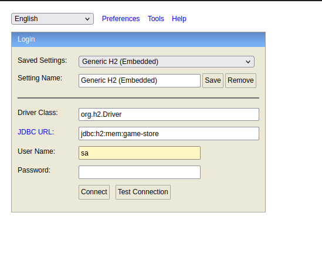
  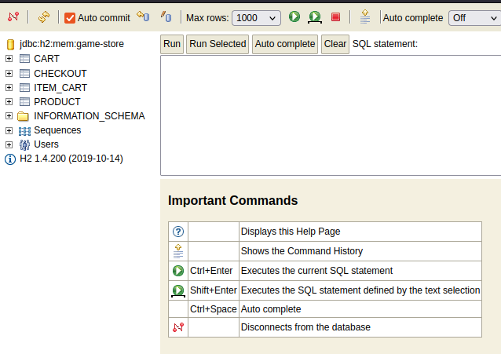 

### Cliente REST para realizar testes - Postman

Para realizar os testes da aplicação, foi utilizado a ferramenta "Postman", escolhido pela facilidade de comunicação dos end-points.

### Endpoint usados:

#### Product
Criação de produto:  
* Método POST 
* End-point: http://localhost:8080/products/

  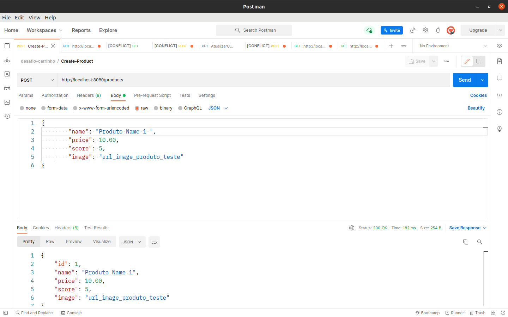

#### Atualização produto:  
* Método PUT 
* End-point: http://localhost:8080/products/{id_product}

  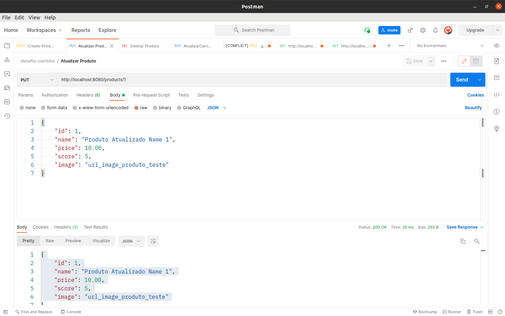

#### Deletar produto:  
* Método DELETE 
* End-point: http://localhost:8080/products/{id_product}

  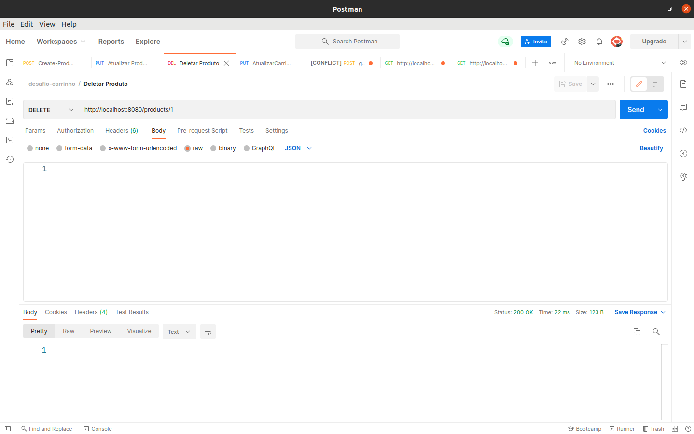

#### Obter produto por id:  
* Método GET 
* End-point: http://localhost:8080/products/{id_product}

  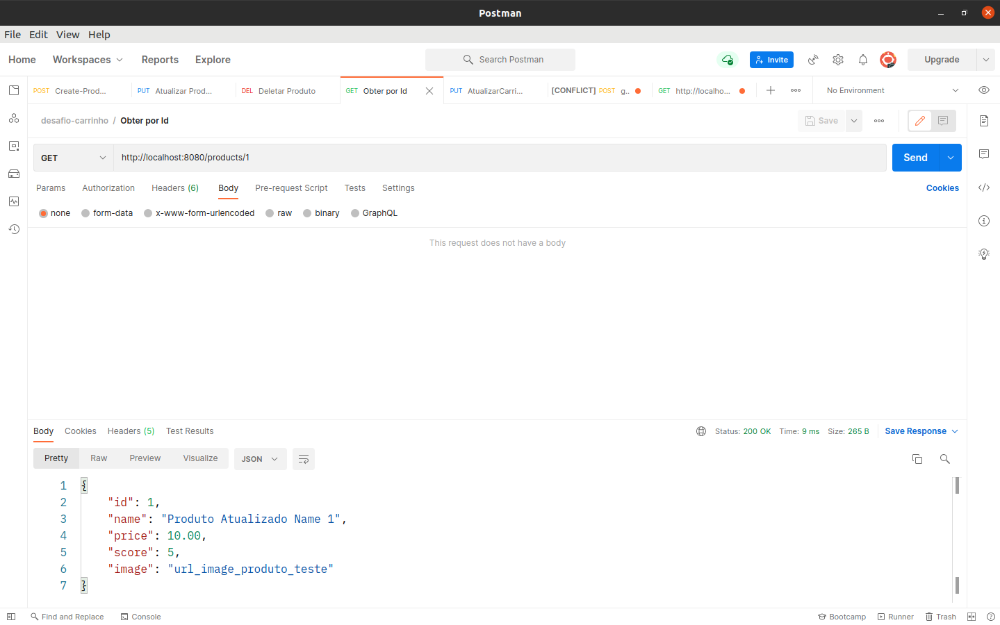

#### Listar todos produto:  
* Método GET 
* End-point: http://localhost:8080/products/

  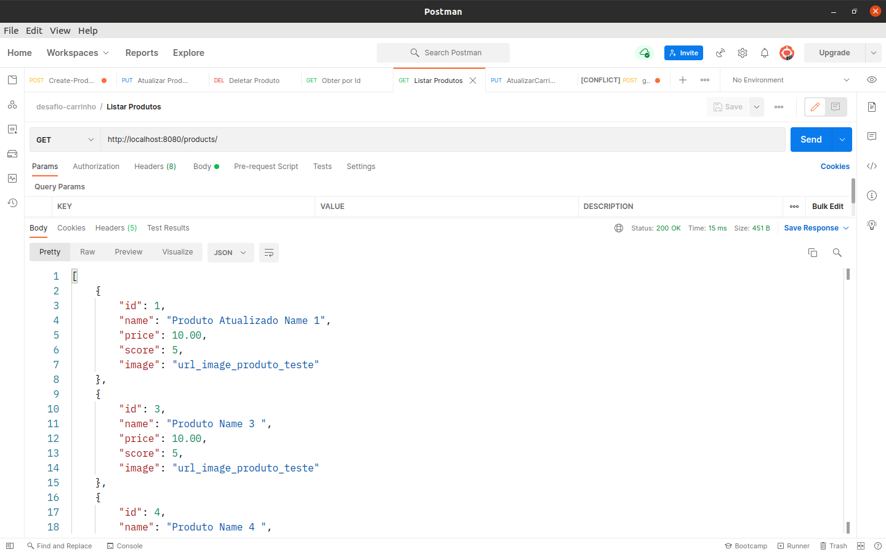

### Ordenação

#### Ordenar por nome em ordem alfabética:  
* Método GET 
* End-point: http://localhost:8080/products?sort=name,asc

  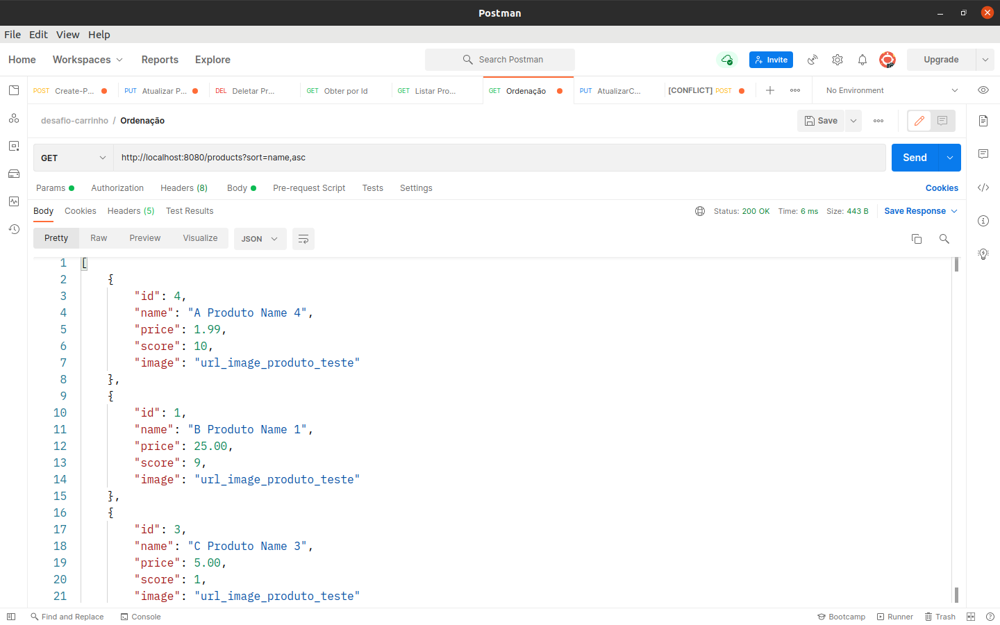

#### Ordenar por maior score:  
* Método GET 
* End-point: http://localhost:8080/products?sort=score,desc

  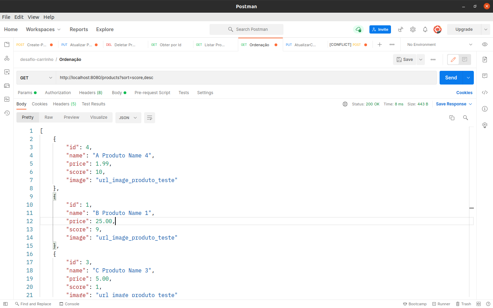

#### Ordenar por preço crescente:  
* Método GET 
* End-point: http://localhost:8080/products?sort=price,asc

  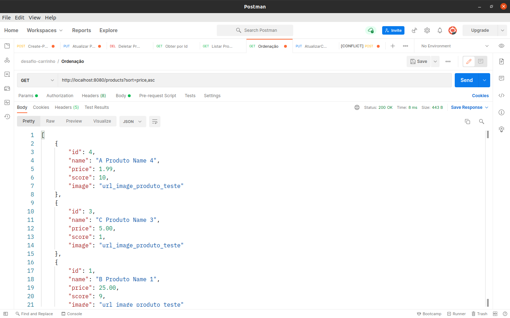

### Carrinho

#### Criar carrinho:  
* Método POST 
* End-point: http://localhost:8080/cart

  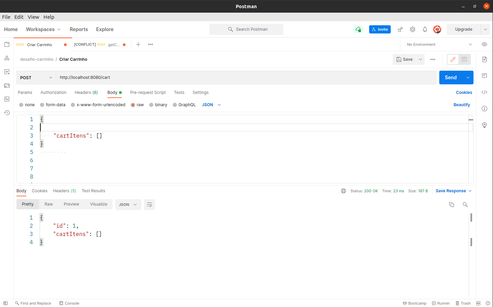

#### Adicionar item ao carrinho:  
* Método POST 
* End-point: http://localhost:8080/cart/addItemCart/{id_cart}

  

#### Atualizar carrinho:  
* Método PUT 
* End-point: http://localhost:8080/cart/{id}

  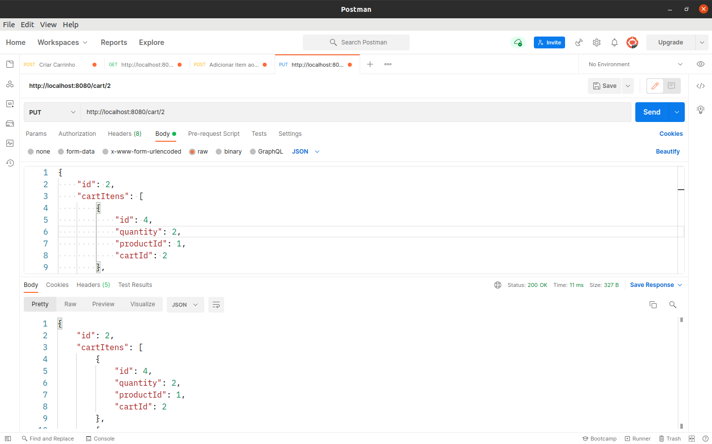

#### Remover item do carrinho:  
* Método DELETE 
* End-point: http://localhost:8080/cart/removeItemCart/{id_cart}

  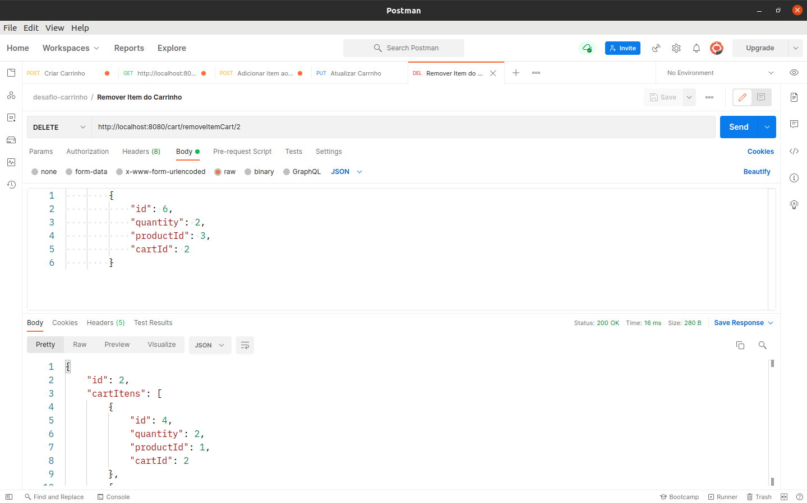

mais alguns..

#### Obter carrinho por id: 
* Método GET
* End-point: http://localhost:8080/cart/{id_cart}

#### Obter todos carrinhos: 
* Método GET
* End-point: http://localhost:8080/cart/

### Check-out

#### Realizar pre-checkout com id do carrinho:  
* Método GET 
* End-point: http://localhost:8080/checkout/consult/{id_cart}

  

#### Salvar Checkout:  
* Método POST 
* End-point: http://localhost:8080/checkout

  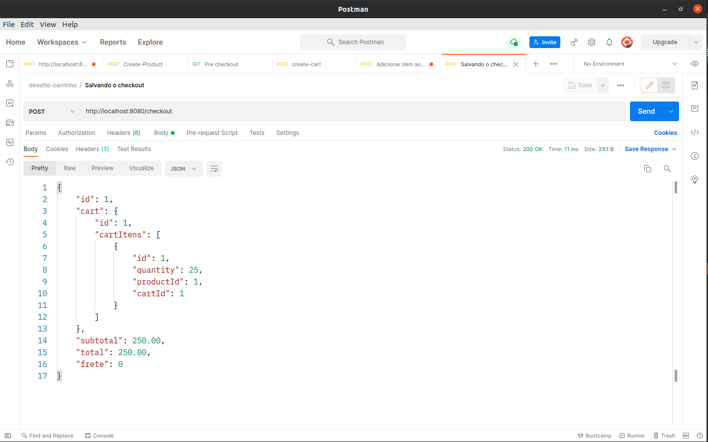

#### Atualizar checkout: 
* Método PUT
* End-point: http://localhost:8080/checkout/{id_checkout}

#### Deletar checkout: 
* Método DELETE
* End-point: http://localhost:8080/checkout/{id_checkout}

***** As informações Subtotal, Total e Frete, são dinâmicas, iram mudar de acordo com os itens do carrinho,
cada item adicionado no carrinho é acrescido 10,00 no frete, se o valor total chegar a 250,00, o frete será Gratuito de acordo com a regra de negócio.
